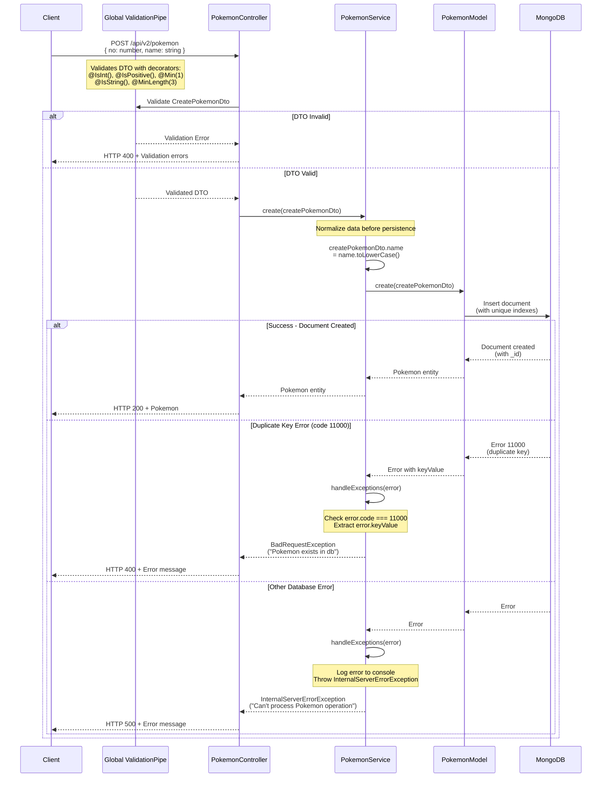
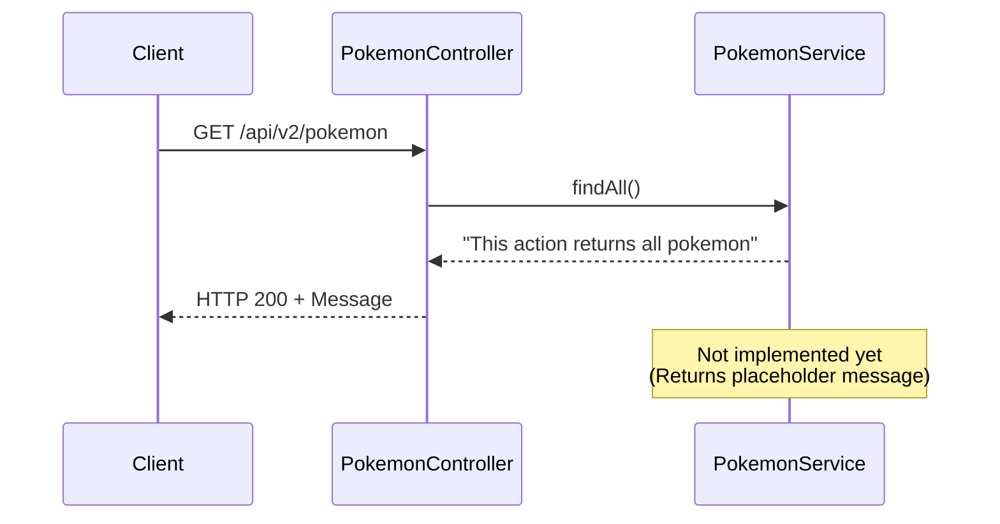
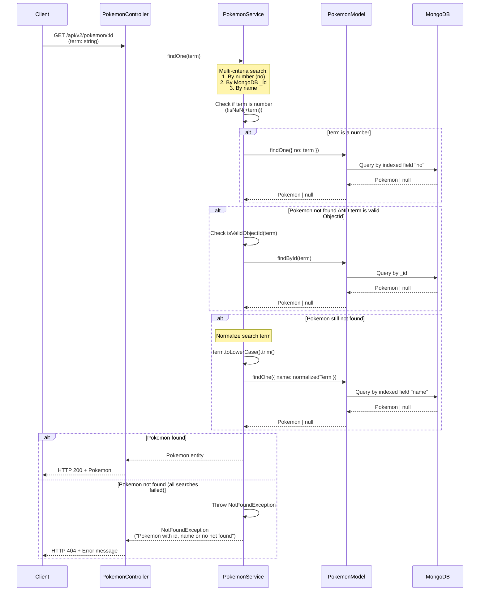
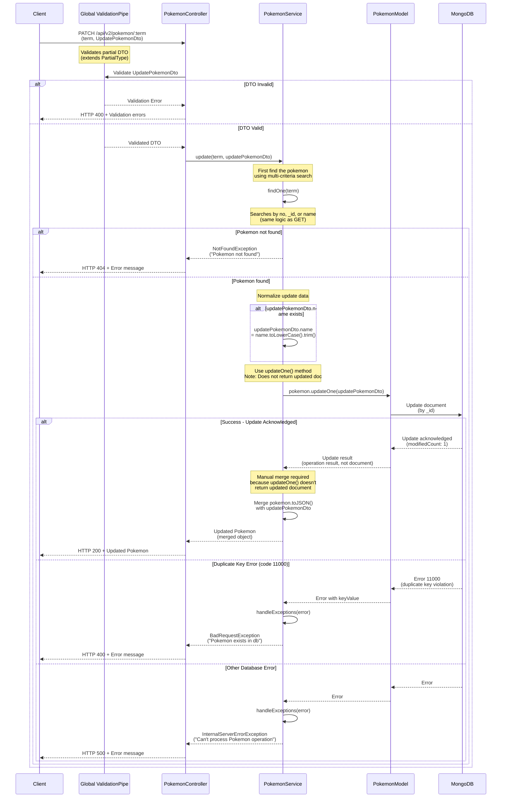
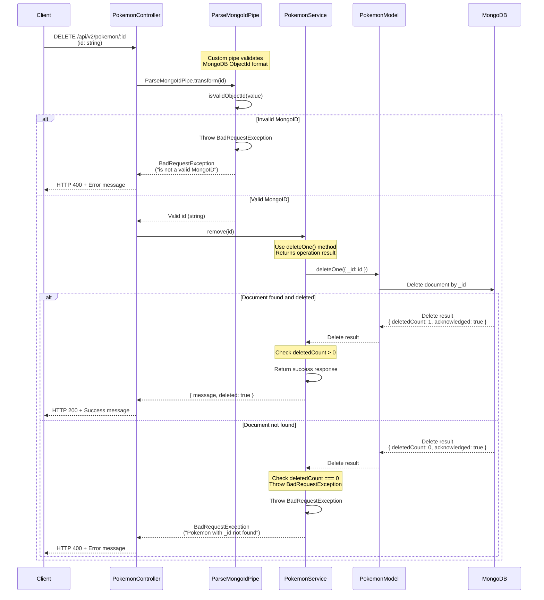
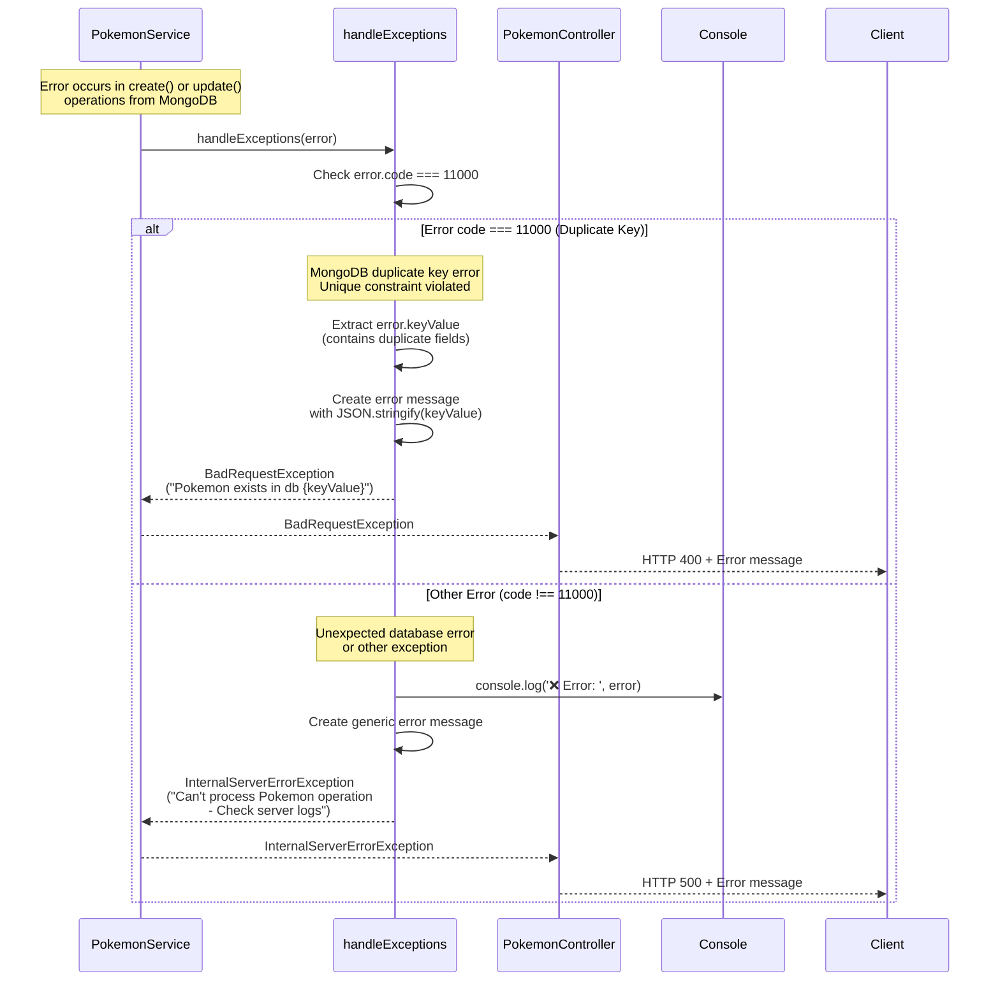
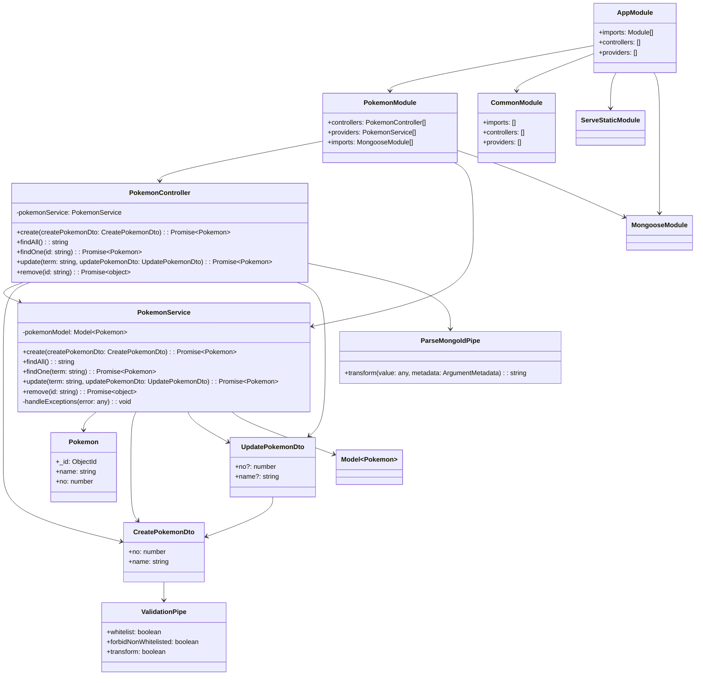

<p align="center">
  <a href="http://nestjs.com/" target="blank"></a>
</p>

[circleci-image]: https://img.shields.io/circleci/build/github/nestjs/nest/master?token=abc123def456
[circleci-url]: https://circleci.com/gh/nestjs/nest

  <p align="center">A progressive <a href="http://nodejs.org" target="_blank">Node.js</a> framework for building efficient and scalable server-side applications.</p>
    <p align="center">
<a href="https://www.npmjs.com/~nestjscore" target="_blank"></a>
<a href="https://www.npmjs.com/~nestjscore" target="_blank"></a>
<a href="https://www.npmjs.com/~nestjscore" target="_blank"></a>
<a href="https://circleci.com/gh/nestjs/nest" target="_blank"></a>
<a href="https://discord.gg/G7Qnnhy" target="_blank"></a>
<a href="https://opencollective.com/nest#backer" target="_blank"></a>
<a href="https://opencollective.com/nest#sponsor" target="_blank"></a>
  <a href="https://paypal.me/kamilmysliwiec" target="_blank"></a>
    <a href="https://opencollective.com/nest#sponsor"  target="_blank"></a>
  <a href="https://twitter.com/nestframework" target="_blank"></a>
</p>
  <!--[](https://opencollective.com/nest#backer)
  [](https://opencollective.com/nest#sponsor)-->

## Description

[Nest](https://github.com/nestjs/nest) framework TypeScript starter repository.

This is a **Pokedex API** project built with NestJS and MongoDB, implementing a complete CRUD (Create, Read, Update, Delete) system for managing Pokemon data. The project demonstrates modern backend development practices using TypeScript, MongoDB with Mongoose, Docker, and various NestJS features.

## 📋 Project Status & Progress

### ✅ Objectives Achieved

- **Project Setup**: Successfully initialized NestJS project with proper structure
- **Static Content Serving**: Configured static file serving for frontend assets
- **REST API**: Implemented complete CRUD operations for Pokemon resource
- **MongoDB Integration**: Connected NestJS application with MongoDB using Mongoose
- **Database Schema**: Created Pokemon schema with unique constraints and indexes
- **Data Validation**: Implemented DTO validation using class-validator
- **Error Handling**: Centralized exception handling with custom error messages
- **Custom Pipes**: Created ParseMongoIdPipe for MongoDB ObjectId validation
- **Multi-criteria Search**: Implemented flexible search by ID, name, or number
- **Docker Setup**: Configured MongoDB container using Docker Compose

### 📚 Topics Covered

1. **NestJS Fundamentals**
   - Module architecture and dependency injection
   - Controller and Service pattern
   - Global prefix configuration
   - Static file serving

2. **MongoDB & Mongoose**
   - MongoDB connection setup
   - Schema definition with decorators
   - Model injection and usage
   - CRUD operations (Create, Read, Update, Delete)
   - Unique constraints and indexes
   - ObjectId validation

3. **Data Validation**
   - DTO (Data Transfer Objects) pattern
   - class-validator decorators
   - Global ValidationPipe configuration
   - Input sanitization and normalization

4. **Error Handling**
   - Custom exception classes (BadRequestException, NotFoundException, InternalServerErrorException)
   - Centralized error handling method
   - MongoDB error code handling (duplicate key errors)

5. **Custom Pipes**
   - PipeTransform interface implementation
   - Parameter-level validation
   - MongoDB ObjectId validation

6. **Docker**
   - Docker Compose configuration
   - MongoDB container setup
   - Volume management for data persistence

7. **TypeScript**
   - Type safety and interfaces
   - Decorators usage
   - Async/await patterns

### 🎯 Skills Developed & Learned

- **Backend Architecture**: Understanding of layered architecture (Controller → Service → Repository)
- **RESTful API Design**: Proper HTTP methods, status codes, and endpoint design
- **Database Design**: Schema design with constraints, indexes, and relationships
- **Error Handling**: Proper exception handling and error response formatting
- **Validation**: Input validation at multiple layers (DTO, Pipe, Service)
- **Docker**: Container orchestration and database setup
- **MongoDB Operations**: Understanding of Mongoose methods (create, findOne, findById, updateOne, deleteOne)
- **TypeScript**: Advanced TypeScript features in NestJS context
- **Code Organization**: Modular architecture and separation of concerns
- **Testing Preparation**: Project structure ready for unit and e2e testing

### 📝 Pending Tasks / Future Topics

- [ ] **Pagination**: Implement pagination for `findAll()` method
- [ ] **Filtering & Sorting**: Add query parameters for filtering and sorting Pokemon
- [ ] **Search Enhancement**: Implement full-text search capabilities
- [ ] **Authentication & Authorization**: Add JWT-based authentication
- [ ] **Rate Limiting**: Implement API rate limiting
- [ ] **Caching**: Add Redis caching for frequently accessed data
- [ ] **Logging**: Implement structured logging (Winston, Pino)
- [ ] **Environment Configuration**: Use ConfigModule for environment variables
- [ ] **Unit Tests**: Write unit tests for services and controllers
- [ ] **E2E Tests**: Implement end-to-end tests
- [ ] **API Documentation**: Add Swagger/OpenAPI documentation
- [ ] **Database Migrations**: Implement migration system for schema changes
- [ ] **Health Checks**: Add health check endpoints
- [ ] **GraphQL**: Explore GraphQL implementation as alternative to REST
- [ ] **WebSockets**: Implement real-time features using WebSockets
- [ ] **File Upload**: Add image upload functionality for Pokemon
- [ ] **Seeding**: Create database seeding scripts for initial data
- [ ] **Deployment**: Configure deployment pipeline (CI/CD)
- [ ] **Monitoring**: Add application monitoring and metrics

### 📊 Documentation

## 📊 Application Diagrams

This section contains sequence diagrams for each method in `pokemon.service.ts`, class diagrams, and state diagrams for better understanding of the application architecture.

### 🔄 Sequence Diagrams

#### 1. Create Pokemon Sequence Diagram



#### 2. Find All Pokemon Sequence Diagram



#### 3. Find One Pokemon Sequence Diagram



#### 4. Update Pokemon Sequence Diagram



#### 5. Remove Pokemon Sequence Diagram



#### 6. Handle Exceptions Sequence Diagram



### 🏗️ Class Diagram



### 📝 Diagram Notes

#### Key Design Patterns Used:

1. **Dependency Injection**: Services and controllers use NestJS DI system
2. **Repository Pattern**: PokemonService acts as a repository for Pokemon entities
3. **DTO Pattern**: Data Transfer Objects for validation and type safety
4. **Pipe Pattern**: ParseMongoIdPipe for input transformation and validation
5. **Exception Handling**: Centralized error handling via handleExceptions method

#### Database Operations:

- **Create**: Uses `pokemonModel.create()` with duplicate key error handling
- **Read**: Uses `findOne()`, `findById()` with multi-criteria search
- **Update**: Uses `updateOne()` with manual merge for response
- **Delete**: Uses `deleteOne()` with validation check

#### Validation Flow:

1. **Global ValidationPipe**: Validates all DTOs at controller level
2. **Custom ParseMongoIdPipe**: Validates MongoDB ObjectId format
3. **MongoDB Constraints**: Unique indexes on `name` and `no` fields
4. **Service-level Validation**: Business logic validation (normalization, existence checks)

## Project setup

```bash
$ npm install
```

## Compile and run the project

```bash
# development
$ npm run start

# watch mode
$ npm run start:dev

# production mode
$ npm run start:prod
```

## Run tests

```bash
# unit tests
$ npm run test

# e2e tests
$ npm run test:e2e

# test coverage
$ npm run test:cov
```


## 📖 Best Practices Summary: Building REST APIs with NestJS and MongoDB

This section summarizes the essential practices and patterns learned throughout the lectures for building robust REST APIs with NestJS and MongoDB.

### 🏗️ Project Structure & Setup

#### 1. **Initial Project Configuration**
- Clean up default NestJS boilerplate (remove `app.controller.ts` and `app.service.ts` if not needed)
- Configure `AppModule` with proper imports, controllers, and providers
- Set up global prefix in `main.ts` for API versioning (e.g., `api/v2`)
- Use environment variables for configuration (PORT, database URLs)

#### 2. **Static Content Serving**
- Use `@nestjs/serve-static` for serving static files
- Configure `ServeStaticModule` in `AppModule` with proper path resolution
- Keep static assets in a dedicated `public` folder

#### 3. **Module Organization**
- Follow feature-based module structure (one module per feature)
- Create a `CommonModule` for shared utilities, pipes, and filters
- Keep modules focused and cohesive (Single Responsibility Principle)

### 🗄️ MongoDB Integration

#### 4. **Database Setup with Docker**
- Use Docker Compose for local MongoDB development
- Configure proper volume mapping for data persistence
- Set restart policies for production-like environments
- Document connection strings and database names

#### 5. **Mongoose Schema Design**
- **Extend Document**: Always extend `Document` from mongoose
- **Use Decorators**: Leverage `@Schema()` and `@Prop()` decorators
- **Indexes**: Add indexes for frequently queried fields
- **Unique Constraints**: Use `unique: true` for fields that must be unique
- **Validation**: Combine schema-level validation with DTO validation

```typescript
@Schema()
export class Pokemon extends Document {
  @Prop({ unique: true, index: true })
  name: string;
  
  @Prop({ unique: true, index: true })
  no: number;
}
```

#### 6. **Model Injection**
- Use `@InjectModel()` decorator in services
- Register schemas in feature modules using `MongooseModule.forFeature()`
- Use `Pokemon.name` for model name consistency

### ✅ Data Validation

#### 7. **DTO Pattern**
- Create separate DTOs for Create and Update operations
- Use `PartialType()` from `@nestjs/mapped-types` for Update DTOs
- Apply validation decorators from `class-validator`:
  - `@IsString()`, `@IsInt()`, `@IsPositive()`
  - `@Min()`, `@Max()`, `@MinLength()`, `@MaxLength()`
  - `@IsOptional()` for optional fields

#### 8. **Global Validation Pipe**
- Configure `ValidationPipe` globally in `main.ts`
- Use `whitelist: true` to strip non-whitelisted properties
- Use `forbidNonWhitelisted: true` to throw errors for extra properties
- Use `transform: true` for automatic type transformation

```typescript
app.useGlobalPipes(
  new ValidationPipe({
    whitelist: true,
    forbidNonWhitelisted: true,
    transform: true,
  }),
);
```

#### 9. **Custom Pipes**
- Create custom pipes for specific validations (e.g., `ParseMongoIdPipe`)
- Implement `PipeTransform` interface
- Throw appropriate exceptions (`BadRequestException`) for invalid input
- Use pipes at parameter level for route-specific validation

### 🔄 CRUD Operations

#### 10. **Create Operations**
- Normalize input data before saving (e.g., lowercase strings)
- Use `try-catch` blocks for error handling
- Handle MongoDB duplicate key errors (code 11000)
- Return created entity with proper HTTP status codes

```typescript
async create(createPokemonDto: CreatePokemonDto) {
  createPokemonDto.name = createPokemonDto.name.toLowerCase();
  try {
    const pokemon = await this.pokemonModel.create(createPokemonDto);
    return pokemon;
  } catch (error) {
    this.handleExceptions(error);
  }
}
```

#### 11. **Read Operations**
- Implement flexible search (by ID, name, number, etc.)
- Use `findOne()`, `findById()`, or `find()` based on requirements
- Always check for null/undefined and throw `NotFoundException`
- Normalize search terms (lowercase, trim) for consistency

```typescript
async findOne(term: string) {
  let pokemon: Pokemon | null;
  
  if (!isNaN(+term)) {
    pokemon = await this.pokemonModel.findOne({ no: term });
  }
  
  if (!pokemon && isValidObjectId(term)) {
    pokemon = await this.pokemonModel.findById(term);
  }
  
  if (!pokemon) {
    pokemon = await this.pokemonModel.findOne({
      name: term.toLowerCase().trim(),
    });
  }
  
  if (!pokemon) {
    throw new NotFoundException(`Pokemon with term "${term}" not found`);
  }
  
  return pokemon;
}
```

#### 12. **Update Operations**
- Find entity first, then update (ensures existence)
- Normalize update data before applying changes
- Use `updateOne()` with manual merge OR `findByIdAndUpdate()` with `{ new: true }`
- Handle duplicate key errors during updates

**Important**: `updateOne()` doesn't return the updated document. Use:
- Option 1: `findByIdAndUpdate()` with `{ new: true }`
- Option 2: Manual merge: `{ ...pokemon.toJSON(), ...updatePokemonDto }`

#### 13. **Delete Operations**
- Validate MongoDB ObjectId before deletion (use custom pipe)
- Use `deleteOne()` and check `deletedCount` for existence validation
- Return meaningful success/error messages
- Consider soft deletes for important data

```typescript
async remove(id: string) {
  const { deletedCount } = await this.pokemonModel.deleteOne({ _id: id });
  if (deletedCount === 0) {
    throw new BadRequestException(`Pokemon with id "${id}" not found`);
  }
  return { message: `Pokemon deleted successfully`, deleted: true };
}
```

### 🚨 Error Handling

#### 14. **Centralized Exception Handling**
- Create a private `handleExceptions()` method in services
- Handle specific MongoDB error codes (e.g., 11000 for duplicates)
- Use appropriate NestJS exceptions:
  - `BadRequestException` for client errors (400)
  - `NotFoundException` for missing resources (404)
  - `InternalServerErrorException` for server errors (500)
- Log errors for debugging while returning user-friendly messages

```typescript
private handleExceptions(error: any) {
  if (error.code === 11000) {
    throw new BadRequestException(
      `Pokemon exists in db ${JSON.stringify(error.keyValue)}`,
    );
  }
  console.log('❌ Error: ', error);
  throw new InternalServerErrorException(
    `Can't process Pokemon operation - Check server logs`,
  );
}
```

#### 15. **HTTP Status Codes**
- Use `@HttpCode()` decorator for custom status codes
- Follow REST conventions:
  - `200 OK` for successful GET, PUT, PATCH, DELETE
  - `201 Created` for successful POST (or `200 OK` if preferred)
  - `400 Bad Request` for validation errors
  - `404 Not Found` for missing resources
  - `500 Internal Server Error` for server errors

### 🎯 Controller Best Practices

#### 16. **Controller Structure**
- Keep controllers thin - delegate business logic to services
- Use dependency injection for services
- Apply validation pipes at controller level
- Use appropriate HTTP decorators (`@Get()`, `@Post()`, `@Patch()`, `@Delete()`)
- Extract route parameters using `@Param()` decorator

#### 17. **Route Parameters**
- Use descriptive parameter names (`term` for flexible search, `id` for specific identifiers)
- Apply custom pipes at parameter level for validation
- Type parameters appropriately (string for MongoDB ObjectId)

### 📦 Code Organization

#### 18. **Service Layer**
- Services contain business logic and database operations
- Inject models using `@InjectModel()` decorator
- Use async/await for all database operations
- Keep methods focused and single-purpose
- Normalize data at service level before persistence

#### 19. **Entity/Schema Design**
- Place entities in `entities/` folder within feature module
- Export both entity class and schema
- Use descriptive property names
- Add JSDoc comments for complex schemas

#### 20. **DTO Organization**
- Place DTOs in `dto/` folder within feature module
- Name DTOs descriptively (`CreatePokemonDto`, `UpdatePokemonDto`)
- Reuse DTOs with `PartialType()` when possible
- Keep DTOs focused on data transfer, not business logic

### 🔧 Development Workflow

#### 21. **Testing**
- Test endpoints using Postman or similar tools
- Verify validation rules with invalid data
- Test error scenarios (duplicates, not found, invalid IDs)
- Test normalization (case-insensitive searches, trimmed strings)

#### 22. **Database Management**
- Use database GUI tools (TablePlus, MongoDB Compass) for data inspection
- Keep database clean during development (delete test data)
- Document database schema changes
- Use migrations for production schema changes

### 📝 Key Takeaways

1. **Always validate input** at multiple layers (DTO, Pipe, Service)
2. **Normalize data** before persistence (lowercase, trim)
3. **Handle errors gracefully** with appropriate HTTP status codes
4. **Use indexes** for frequently queried fields
5. **Implement flexible search** when possible (multiple criteria)
6. **Centralize error handling** to avoid code duplication
7. **Follow REST conventions** for HTTP methods and status codes
8. **Keep controllers thin** and services focused
9. **Use TypeScript types** for better code safety
10. **Document your code** with clear naming and comments

### 🚀 Next Steps

When building similar APIs, consider:
- Pagination for list endpoints
- Filtering and sorting capabilities
- Authentication and authorization
- Rate limiting
- Caching strategies
- Comprehensive logging
- API documentation (Swagger/OpenAPI)
- Unit and E2E testing
- Environment configuration management
- Health check endpoints    