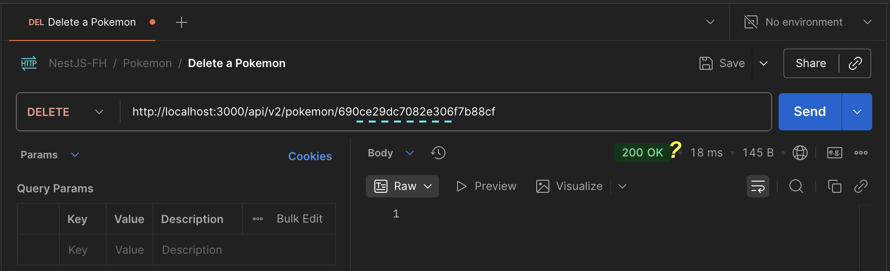

<p align="center">
  <a href="http://nestjs.com/" target="blank"></a>
</p>

[circleci-image]: https://img.shields.io/circleci/build/github/nestjs/nest/master?token=abc123def456
[circleci-url]: https://circleci.com/gh/nestjs/nest

  <p align="center">A progressive <a href="http://nodejs.org" target="_blank">Node.js</a> framework for building efficient and scalable server-side applications.</p>
    <p align="center">
<a href="https://www.npmjs.com/~nestjscore" target="_blank"></a>
<a href="https://www.npmjs.com/~nestjscore" target="_blank"></a>
<a href="https://www.npmjs.com/~nestjscore" target="_blank"></a>
<a href="https://circleci.com/gh/nestjs/nest" target="_blank"></a>
<a href="https://discord.gg/G7Qnnhy" target="_blank"></a>
<a href="https://opencollective.com/nest#backer" target="_blank"></a>
<a href="https://opencollective.com/nest#sponsor" target="_blank"></a>
  <a href="https://paypal.me/kamilmysliwiec" target="_blank"></a>
    <a href="https://opencollective.com/nest#sponsor"  target="_blank"></a>
  <a href="https://twitter.com/nestframework" target="_blank"></a>
</p>
  <!--[](https://opencollective.com/nest#backer)
  [](https://opencollective.com/nest#sponsor)-->

## Description

[Nest](https://github.com/nestjs/nest) framework TypeScript starter repository.

## Project setup

```bash
$ npm install
```

## Compile and run the project

```bash
# development
$ npm run start

# watch mode
$ npm run start:dev

# production mode
$ npm run start:prod
```

## Run tests

```bash
# unit tests
$ npm run test

# e2e tests
$ npm run test:e2e

# test coverage
$ npm run test:cov
```

 
# 👨🏾‍💻 Section 07 - MongoDB - Pokedex

## 📚  Lecture 069: Starting Pokedex project

```bash
nest new 03-pokedex
```


### Set the project:
1. Delete **`app.controller.ts`** file
2. Delete **`app.service.ts`** file
3. Update **`ap.module.ts`** file:
    ```ts
    import { Module } from '@nestjs/common';
    @Module({
      imports: [],
      controllers: [],
      providers: [],
    })
    export class AppModule {}
    ```


## 📚  Lecture 070: Provide static content

### 1.Add the following files:
```
03-pokedex/
├── dist/
├── node_modules/
├── public/                // 👈🏽 ✅
│   ├── css/               // 👈🏽 ✅
│   │   └── styless.css    // 👈🏽 ✅
│   └── index.html                  
├── src/                     
│   ├── app.module.ts
│   └── main.ts 
├── test/                     
│   ├── app.e2e-spec.ts
│   └── jest-e2e.json
├── .gitignore        
├── .prettierrc  
├── eslint.config.mjs      
├── nest-cli.json  
├── package-lock.json       
├── package.json
├── README.md
├── tsconfig.build.json      
└── tsconfig.json                       
```

### 2. Install **`@nestjs/serve-static`** dependency:
```bash
npm i @nestjs/serve-static
```

### 3. Add the following code in **`app.module.ts`**:
```ts
// ./src/app.module.ts
import { join } from 'path';    // 👈🏽 ✅
import { Module } from '@nestjs/common';
import { ServeStaticModule } from '@nestjs/serve-static';   // 👈🏽 ✅
@Module({
  imports: [
    ServeStaticModule.forRoot({   // 👈🏽 ✅
      rootPath: join(__dirname, '..', 'public'),    // 👈🏽 ✅
    }),
  ],
  controllers: [],
  providers: [],
})
export class AppModule {}
```

Go to any browser and enter to **`http://localhost:3000/`**


## 📚  Lecture 071: Global Prefix

### 1. create **`Pokemon`** resource:
```bash
nest g res pokemon --no-spec
---
✔ What transport layer do you use? REST API
✔ Would you like to generate CRUD entry points? Yes
CREATE src/pokemon/pokemon.controller.ts (946 bytes)
CREATE src/pokemon/pokemon.module.ts (262 bytes)
CREATE src/pokemon/pokemon.service.ts (649 bytes)
CREATE src/pokemon/dto/create-pokemon.dto.ts (33 bytes)
CREATE src/pokemon/dto/update-pokemon.dto.ts (181 bytes)
CREATE src/pokemon/entities/pokemon.entity.ts (24 bytes)
UPDATE package.json (2050 bytes)
UPDATE src/app.module.ts (388 bytes)
✔ Packages installed successfully.
```

### 2. Visual Project Structure:
```
03-pokedex/
├── dist/
├── node_modules/
├── public/              
│   ├── css/               
│   │   └── styless.css    
│   └── index.html                  
├── src/                     
│   ├── pokemon/                              // 👈🏽 ✅          
|   │   ├── dto/                              // 👈🏽 ✅            
|   |   │   ├── create-pokemon.dto.ts               
|   |   │   └── update-pokemon.dto.ts 
|   │   ├── entities/                         // 👈🏽 ✅              
|   |   │   └── pokemon.entity.ts 
|   │   ├── pokemon.module.ts                 // 👈🏽 ✅             
|   │   ├── pokemon.controller.ts             // 👈🏽 ✅              
|   │   └── pokemon.service.ts                // 👈🏽 ✅
│   ├── app.module.ts
│   └── main.ts 
├── test/                     
│   ├── app.e2e-spec.ts
│   └── jest-e2e.json
├── .gitignore        
├── .prettierrc  
├── eslint.config.mjs      
├── nest-cli.json  
├── package-lock.json       
├── package.json
├── README.md
├── tsconfig.build.json      
└── tsconfig.json                       
```

### 3. Testing in POSTMAN:
1. Open Postman
2. Create a new Request
3. Test:
- GET http://localhost:3000
- GET http://localhost:3000/pokemon
- POST http://localhost:3000/pokemon
- GET http://localhost:3000/pokemon/1

In case we need to work with **`http://localhost:3000/api/pokemon`**

### 4. Change the Global Prefix:
Open **`main.ts`** file then add as follows:
```ts
import { NestFactory } from '@nestjs/core';
import { AppModule } from './app.module';
async function bootstrap() {
  const app = await NestFactory.create(AppModule);
  app.setGlobalPrefix('api');  // 👈🏽 ✅
  await app.listen(process.env.PORT ?? 3000);
}
bootstrap();
```

1. Test:
- GET http://localhost:3000
- GET http://localhost:3000/pokemon
- POST http://localhost:3000/pokemon
- GET http://localhost:3000/pokemon/1

2. Test again:
- GET http://localhost:3000
- GET http://localhost:3000/api/pokemon
- POST http://localhost:3000/api/pokemon
- GET http://localhost:3000/api/pokemon/1


```ts
import { NestFactory } from '@nestjs/core';
import { AppModule } from './app.module';
async function bootstrap() {
  const app = await NestFactory.create(AppModule);
  app.setGlobalPrefix('api/v2');  // 👈🏽 ✅
  await app.listen(process.env.PORT ?? 3000);
}
bootstrap();
```

## 📚 Lecture 072: Docker - DockerCompose - MongoDB

### 1. Create **`docker-compose.yaml`** file:
```yaml

version: '3'

services:
    db:
      image: mongo:5
      restart: always
      ports:
        - 27017:27017
      environment:
        MONGODB_DATABASE: nest-pokemon  
      volumes:
        - ./mongo:/data/db
```

### 1. Run docker-compose up:
```bash
docker-compose up -d
```

#### 1.1. Verify project structure:
```
03-pokedex/
├── dist/
├── mongo/                                // 👈🏽 ✅           
│   ├── diagnostic.data/               
│   ├── journal/               
│   └── ...                  
├── node_modules/
├── public/              
│   ├── css/               
│   │   └── styless.css    
│   └── index.html                  
├── src/                     
│   ├── pokemon/                                      
|   │   ├── dto/                              
|   |   │   ├── create-pokemon.dto.ts               
|   |   │   └── update-pokemon.dto.ts 
|   │   ├── entities/                         
|   |   │   └── pokemon.entity.ts 
|   │   ├── pokemon.module.ts                 
|   │   ├── pokemon.controller.ts             
|   │   └── pokemon.service.ts                
│   ├── app.module.ts
│   └── main.ts 
├── test/                     
│   ├── app.e2e-spec.ts
│   └── jest-e2e.json
├── .gitignore        
├── .prettierrc  
├── eslint.config.mjs      
├── nest-cli.json  
├── package-lock.json       
├── package.json
├── README.md
├── tsconfig.build.json      
└── tsconfig.json                       
```

#### 1.2. Verify docker-desktop:


### 2. Connect MongoDB with **`TablePlus`**:
Click on **`Create connection`**


Chose **`Mongo`** then click on **`Create`** button.


Enter in URL:  **`mongodb://localhost:27017/nest-pokemon`** then click on **`Test`** button.

```yaml
version: '3'
services:
    db:
      image: mongo:5
      restart: always
      ports:
        - 27017:27017*
      environment:
        MONGODB_DATABASE: nest-pokemon*  
      volumes:
        - ./mongo:/data/db
```
- Verify the URL must be green as prvious picture.
- Verify **`03-pokedex`** database in docker desktop must be running.


## 📚 Lecture 074: Connect Nest with MongoDB

### 1. Integrate Nestjs with MongoDB:
```bash
npm install --save @nestjs/mongoose mongoose
```

### 2. Start the configuration with MongoDB from **`app.module.ts`** file:
```ts
import { join } from 'path';
import { Module } from '@nestjs/common';
import { ServeStaticModule } from '@nestjs/serve-static';
import { PokemonModule } from './pokemon/pokemon.module';
import { MongooseModule } from '@nestjs/mongoose';  // 👈🏽 ✅
@Module({
  imports: [
    ServeStaticModule.forRoot({
      rootPath: join(__dirname, '..', 'public'),
    }),
    MongooseModule.forRoot('mongodb://localhost:27017/nest-pokemon'),  // 👈🏽 ✅
    PokemonModule,
  ],
  controllers: [],
  providers: [],
})
export class AppModule {}
```


In case the database container from Docker desktop is down o close, run again:
```bash
docker-compose up -d
```

## 📚  Lecture 075: Create Schemas & Models

### 1. Open **`pokemon.entity.ts`** file:
```ts
// ./src/pokemon/entities/pokemon.entity.ts
import { Prop, Schema, SchemaFactory } from '@nestjs/mongoose';
import { Document } from 'mongoose';
@Schema()
export class Pokemon extends Document {
  @Prop({
    unique: true,
    index: true,
  })
  name: string;
  @Prop({
    unique: true,
    index: true,
  })
  no: number;
}
export const PokemonSchema = SchemaFactory.createForClass(Pokemon);
```

### 2. Define our PokemonEntity in **`Pokemon.module.ts`** file:
```ts
// ./src/pokemon/pokemon.module.ts
import { Module } from '@nestjs/common';
import { PokemonService } from './pokemon.service';
import { PokemonController } from './pokemon.controller';
import { MongooseModule } from '@nestjs/mongoose';
import { Pokemon, PokemonSchema } from './entities/pokemon.entity';
@Module({
  controllers: [PokemonController],
  providers: [PokemonService],
  imports: [
    MongooseModule.forFeature([     // 👈🏽 ✅
      {
        name: Pokemon.name,         // 👈🏽 ✅
        schema: PokemonSchema,      // 👈🏽 ✅
      },
    ]),
  ],
})
export class PokemonModule {}
```

Go to TablePlus then update with `CMD/CTRL + R`


## 📚  Lecture 076. POST - Receive and validate data

### 1. open **`create-pokemon.dto.ts`** file:
```ts
/* ./src/pokemon/dto/create-pokemon.dto.ts */
export class CreatePokemonDto {
  // isInt, isPossitive, minLength(2)
  no: number;
  // isString, minLength(2)
  name: string;
}
```


### 2. Before, install **`class-validator`** and **`class-transformer`**
```bash
npm i class-validator class-transformer
```

### 3. Add the Global validation in **`main.ts`** file:
```ts
/* ./src/main.ts */
import { NestFactory } from '@nestjs/core';
import { AppModule } from './app.module';
import { ValidationPipe } from '@nestjs/common';  // 👈🏽 ✅
async function bootstrap() {
  const app = await NestFactory.create(AppModule);
  app.setGlobalPrefix('api/v2');

  app.useGlobalPipes(               // 👈🏽 ✅
    new ValidationPipe({
      whitelist: true,
      forbidNonWhitelisted: true,
    }),
  );
  await app.listen(process.env.PORT ?? 3000);
}
bootstrap();
```

### 4. Add validation in **`create-pokemon.dto.ts`** file:
```ts
import { IsInt, IsPositive, IsString, Min, MinLength } from 'class-validator';
export class CreatePokemonDto {
  // isInt, isPossitive, minLength(2)
  @IsInt()
  @IsPositive()
  @Min(1)
  no: number;

  // isString, minLength(2)
  @IsString()
  @MinLength(3)
  name: string;
}
```

Testing from POSTMAN:
- Method: **POST**
- URL: http://localhost:3000/api/v2/pokemon
- Payload:
  ```json
  {
    "no": 1, // testing with 0 or '1'
    "name": "Bulasaur" // test options:  "name": "B" 
  }
  ```
- Response:
  ```text
  'This action adds a new pokemon'
  ```
### 5. Modify the **`pokemon.service.ts`** in *create* method.
```ts
import { Injectable } from '@nestjs/common';
import { CreatePokemonDto } from './dto/create-pokemon.dto';
import { UpdatePokemonDto } from './dto/update-pokemon.dto';

@Injectable()
export class PokemonService {
  create(createPokemonDto: CreatePokemonDto) {
    createPokemonDto.name = createPokemonDto.name.toLocaleLowerCase();  // 👈🏽 ✅
    return createPokemonDto;  // 👈🏽 ✅
  }
  findAll() {
    return `This action returns all pokemon`;
  }
  findOne(id: number) {
    return `This action returns a #${id} pokemon`;
  }
  update(id: number, updatePokemonDto: UpdatePokemonDto) {
    return `This action updates a #${id} pokemon`;
  }
  remove(id: number) {
    return `This action removes a #${id} pokemon`;
  }
}
```

Pending notice:
- validate no plus POST with same "no"
- validate no plus POST with same "name"
- validate searching by "no" or "name".


## 📚  Lecture 077: Create a Pokemon inside the Database

### 1. Updating **`pokemon.service.ts`** file in **create** method:
```ts
import { Injectable } from '@nestjs/common';
import { CreatePokemonDto } from './dto/create-pokemon.dto';
import { UpdatePokemonDto } from './dto/update-pokemon.dto';
import { InjectModel } from '@nestjs/mongoose';
import { Model } from 'mongoose';
import { Pokemon } from './entities/pokemon.entity';

@Injectable()
export class PokemonService {
  constructor(
    @InjectModel(Pokemon.name)
    private readonly pokemonModel: Model<Pokemon>,  // 👈🏽 ✅
  ) {}  // 👈🏽 ✅
  create(createPokemonDto: CreatePokemonDto) {
    createPokemonDto.name = createPokemonDto.name.toLocaleLowerCase();
    return createPokemonDto;
  }
  findAll() {
    return `This action returns all pokemon`;
  }
  findOne(id: number) {
    return `This action returns a #${id} pokemon`;
  }
  update(id: number, updatePokemonDto: UpdatePokemonDto) {
    return `This action updates a #${id} pokemon`;
  }
  remove(id: number) {
    return `This action removes a #${id} pokemon`;
  }
}
```

Updated:
```ts
// ./src/pokemon/pokemon.service.ts
import { BadRequestException, Injectable } from '@nestjs/common';
import { CreatePokemonDto } from './dto/create-pokemon.dto';
import { UpdatePokemonDto } from './dto/update-pokemon.dto';
import { InjectModel } from '@nestjs/mongoose';
import { Model } from 'mongoose';
import { Pokemon } from './entities/pokemon.entity';
@Injectable()
export class PokemonService {
  constructor(
    @InjectModel(Pokemon.name)
    private readonly pokemonModel: Model<Pokemon>,
  ) {}

  async create(createPokemonDto: CreatePokemonDto) {
    createPokemonDto.name = createPokemonDto.name.toLocaleLowerCase();
    try {
      const pokemon = await this.pokemonModel.create(createPokemonDto);
      return pokemon;
    } catch (error) {
      // eslint-disable-next-line @typescript-eslint/no-unsafe-member-access
      if (error.code === 11000) {
        throw new BadRequestException(
          // eslint-disable-next-line @typescript-eslint/no-unsafe-member-access
          `Pokemon existe en DB: ${JSON.stringify(error.keyValue)}`,
        );
      }
      throw error;
    }
  }
  findAll() {
    return `This action returns all pokemon`;
  }
  findOne(id: number) {
    return `This action returns a #${id} pokemon`;
  }
  update(id: number, updatePokemonDto: UpdatePokemonDto) {
    return `This action updates a #${id} pokemon`;
  }
  remove(id: number) {
    return `This action removes a #${id} pokemon`;
  }
}
```

## 📚  Lecture 078: Respond a specific error

```ts
//./src/pokemon/pokemon.service.ts
import {
  BadRequestException,
  Injectable,
  InternalServerErrorException,
} from '@nestjs/common';
import { CreatePokemonDto } from './dto/create-pokemon.dto';
import { UpdatePokemonDto } from './dto/update-pokemon.dto';
import { InjectModel } from '@nestjs/mongoose';
import { Model } from 'mongoose';
import { Pokemon } from './entities/pokemon.entity';
@Injectable()
export class PokemonService {
  constructor(
    @InjectModel(Pokemon.name)
    private readonly pokemonModel: Model<Pokemon>,
  ) {}
  async create(createPokemonDto: CreatePokemonDto) {
    createPokemonDto.name = createPokemonDto.name.toLocaleLowerCase();
    try {
      const pokemon = await this.pokemonModel.create(createPokemonDto);
      return pokemon;
    } catch (error) {
      // eslint-disable-next-line @typescript-eslint/no-unsafe-member-access
      if (error.code === 11000) {
        throw new BadRequestException(
          // eslint-disable-next-line @typescript-eslint/no-unsafe-member-access
          `Pokemon existe en DB: ${JSON.stringify(error.keyValue)}`,
        );
      }
      console.log('❌ Error: ', error);
      throw new InternalServerErrorException(
        `Can't create Pokemon - Check server logs`,
      );
    }
  }
  findAll() {
    return `This action returns all pokemon`;
  }
  findOne(id: number) {
    return `This action returns a #${id} pokemon`;
  }
  update(id: number, updatePokemonDto: UpdatePokemonDto) {
    return `This action updates a #${id} pokemon`;
  }
  remove(id: number) {
    return `This action removes a #${id} pokemon`;
  }
}
```

### 1. Add HttpCode decorator:
```ts
// ./src/pokemon/pokemon.controller.ts 
import {
  Controller,
  Get,
  Post,
  Body,
  Patch,
  Param,
  Delete,
  HttpCode,
  HttpStatus,
} from '@nestjs/common';
import { PokemonService } from './pokemon.service';
import { CreatePokemonDto } from './dto/create-pokemon.dto';
import { UpdatePokemonDto } from './dto/update-pokemon.dto';
@Controller('pokemon')
export class PokemonController {
  constructor(private readonly pokemonService: PokemonService) {}
  @Post()
  @HttpCode(HttpStatus.OK)
  create(@Body() createPokemonDto: CreatePokemonDto) {
    return this.pokemonService.create(createPokemonDto);
  }
  @Get()
  findAll() {
    return this.pokemonService.findAll();
  }
  @Get(':id')
  findOne(@Param('id') id: string) {
    return this.pokemonService.findOne(+id);
  }
  @Patch(':id')
  update(@Param('id') id: string, @Body() updatePokemonDto: UpdatePokemonDto) {
    return this.pokemonService.update(+id, updatePokemonDto);
  }
  @Delete(':id')
  remove(@Param('id') id: string) {
    return this.pokemonService.remove(+id);
  }
}
```

## 📚  Lecture 079: FindOneBy - searching by name, Mongo_id or no

```ts
// ./src/pokemon/pokemon.service.ts
import {
  BadRequestException,
  Injectable,
  InternalServerErrorException,  // 👈🏽 ✅
  NotFoundException,  // 👈🏽 ✅
} from '@nestjs/common';
import { CreatePokemonDto } from './dto/create-pokemon.dto';
import { UpdatePokemonDto } from './dto/update-pokemon.dto';
import { InjectModel } from '@nestjs/mongoose';  // 👈🏽 ✅
import { isValidObjectId, Model } from 'mongoose';  // 👈🏽 ✅
import { Pokemon } from './entities/pokemon.entity';
@Injectable()
export class PokemonService {
  constructor(
    @InjectModel(Pokemon.name)
    private readonly pokemonModel: Model<Pokemon>,  // 👈🏽 ✅
  ) {}
  async create(createPokemonDto: CreatePokemonDto) {
    createPokemonDto.name = createPokemonDto.name.toLocaleLowerCase();
    try {
      const pokemon = await this.pokemonModel.create(createPokemonDto);
      return pokemon;
    } catch (error) {
      // eslint-disable-next-line @typescript-eslint/no-unsafe-member-access
      if (error.code === 11000) {
        throw new BadRequestException(
          // eslint-disable-next-line @typescript-eslint/no-unsafe-member-access
          `Pokemon existe en DB: ${JSON.stringify(error.keyValue)}`,
        );
      }
      console.log('❌ Error: ', error);
      throw new InternalServerErrorException(
        `Can't create Pokemon - Check server logs`,
      );
    }
  }
  findAll() {
    return `This action returns all pokemon`;
  }
  async findOne(term: string) {  // 👈🏽 ✅
    let pokemon: Pokemon | null | undefined;
    // search by "no"
    if (!isNaN(+term)) {
      pokemon = await this.pokemonModel.findOne({ no: term });
    }
    // search by MongoID:
    if (!pokemon && isValidObjectId(term)) {
      pokemon = await this.pokemonModel.findById(term);
    }
    // search by name:
    if (!pokemon) {
      pokemon = await this.pokemonModel.findOne({
        name: term.toLowerCase().trim(),
      });
    }
    if (!pokemon)
      throw new NotFoundException(
        `Pokemon with id, name or no "${term}" not found`,
      );
    return pokemon;
  }  // 👈🏽 ✅
  update(id: number, updatePokemonDto: UpdatePokemonDto) {
    return `This action updates a #${id} pokemon`;
  }
  remove(id: number) {
    return `This action removes a #${id} pokemon`;
  }
}
```


## 📚  Lecture 080: Update Pokemon to database
```ts
// ./src/pokemon/pokemon.controller.ts
import {
  Controller,
  Get,
  Post,
  Body,
  Patch,
  Param,
  Delete,
  HttpCode,
  HttpStatus,
} from '@nestjs/common';
import { PokemonService } from './pokemon.service';
import { CreatePokemonDto } from './dto/create-pokemon.dto';
import { UpdatePokemonDto } from './dto/update-pokemon.dto';
@Controller('pokemon')
export class PokemonController {
  constructor(private readonly pokemonService: PokemonService) {}
  @Post()
  @HttpCode(HttpStatus.OK)
  create(@Body() createPokemonDto: CreatePokemonDto) {
    return this.pokemonService.create(createPokemonDto);
  }
  @Get()
  findAll() {
    return this.pokemonService.findAll();
  }
  @Get(':id')
  findOne(@Param('id') id: string) {
    return this.pokemonService.findOne(id);
  }
  @Patch(':term')  // 👈🏽 ✅
  update(
    @Param('term') term: string,
    @Body() updatePokemonDto: UpdatePokemonDto,
  ) {
    return this.pokemonService.update(term, updatePokemonDto);
  }
  @Delete(':id')
  remove(@Param('id') id: string) {
    return this.pokemonService.remove(+id);
  }
}
```

```ts
//./src/pokemon/pokemon.service.ts
import {
  BadRequestException,
  Injectable,
  InternalServerErrorException,
  NotFoundException,
} from '@nestjs/common';
import { CreatePokemonDto } from './dto/create-pokemon.dto';
import { UpdatePokemonDto } from './dto/update-pokemon.dto';
import { InjectModel } from '@nestjs/mongoose';
import { isValidObjectId, Model } from 'mongoose';
import { Pokemon } from './entities/pokemon.entity';

@Injectable()
export class PokemonService {
  constructor(
    @InjectModel(Pokemon.name)
    private readonly pokemonModel: Model<Pokemon>,
  ) {}

  async create(createPokemonDto: CreatePokemonDto) {
    createPokemonDto.name = createPokemonDto.name.toLocaleLowerCase();
    try {
      const pokemon = await this.pokemonModel.create(createPokemonDto);
      return pokemon;
    } catch (error) {
      // eslint-disable-next-line @typescript-eslint/no-unsafe-member-access
      if (error.code === 11000) {
        throw new BadRequestException(
          // eslint-disable-next-line @typescript-eslint/no-unsafe-member-access
          `Pokemon existe en DB: ${JSON.stringify(error.keyValue)}`,
        );
      }
      console.log('❌ Error: ', error);
      throw new InternalServerErrorException(
        `Can't create Pokemon - Check server logs`,
      );
    }
  }

  findAll() {
    return `This action returns all pokemon`;
  }

  async findOne(term: string) {
    let pokemon: Pokemon | null | undefined;

    // search by "no"
    if (!isNaN(+term)) {
      pokemon = await this.pokemonModel.findOne({ no: term });
    }

    // search by MongoID:
    if (!pokemon && isValidObjectId(term)) {
      pokemon = await this.pokemonModel.findById(term);
    }

    // search by name:
    if (!pokemon) {
      pokemon = await this.pokemonModel.findOne({
        name: term.toLowerCase().trim(),
      });
    }

    if (!pokemon)
      throw new NotFoundException(
        `Pokemon with id, name or no "${term}" not found`,
      );

    return pokemon;
  }

  async update(term: string, updatePokemonDto: UpdatePokemonDto) {
    const pokemon = await this.findOne(term);

    if (updatePokemonDto.name)
      updatePokemonDto.name = updatePokemonDto.name.toLowerCase().trim();

    // Option 1: ❌ 
    /*
    const updatedPokemon = await pokemon.updateOne(updatePokemonDto, { new: true });
    return updatedPokemon;
    */

    // Option 2: ✅
    /*
    await pokemon.updateOne(updatePokemonDto);
    return { ...pokemon.toJSON(), ...updatePokemonDto };
    */

    // Option 3: ✅
    const updatedPokemon = await this.pokemonModel.findByIdAndUpdate(
      pokemon._id,
      updatePokemonDto,
      { new: true }, // 👉 it returns an updated document
    );
    return updatedPokemon;
  }

  remove(id: number) {
    return `This action removes a #${id} pokemon`;
  }
}

```
### 🔍 General Context

Your update method does this:
```ts
const pokemon = await this.findOne(term);
const updatedPokemon = await pokemon.updateOne(updatePokemonDto, { new: true });
return updatedPokemon;
```

But then you notice that:

* ✅ In MongoDB, the document does get updated
* 🚫 But the pokemon object (and the Postman response) does not reflect the changes

---

### ⚙️ 1. How updateOne() Works in Mongoose
🔸 `pokemon.updateOne(updatePokemonDto)`

This method:
* Updates the document **directly in the database**, without modifying the in-memory instance.
* **Does not return** the updated document.
* Only returns an **operation result**, for example:

```json
{
  "acknowledged": true,
  "modifiedCount": 1,
  "matchedCount": 1
}
```


Therefore, even though `updatedPokemon` contains this MongoDB operation result,
it does not include the updated document, nor does it modify `pokemon` in memory.

> ⚠️ The option` new: true` has no effect here because `updateOne()` does not support it.
That option only works with `findOneAndUpdate()` or `findByIdAndUpdate()`.


### ⚙️ 2. Why the Other Options Do Reflect the Change

✅ **Option 2**
```ts
await pokemon.updateOne(updatePokemonDto);
return { ...pokemon.toJSON(), ...updatePokemonDto };
```

Here, you manually combine the original document with the updated data:
* `pokemon.toJSON()` converts the Mongoose document into a plain JavaScript object.
* `...updatePokemonDto` overwrites the updated fields.

So, the object you return to Postman **simulates** the updated document state,
even though the in-memory `pokemon` object has not actually changed.

---

✅ **Option 3**
```ts
const updatedPokemon = await this.pokemonModel.findByIdAndUpdate(
  pokemon._id,
  updatePokemonDto,
  { new: true },
);
return updatedPokemon;
```

`findByIdAndUpdate()` does support `new: true`,
and it returns the **updated document** directly from MongoDB.

That’s why the object received in Postman **already contains the updated values**.

---

### 🧩 Comparison of Update Methods in Mongoose

| Method | Updates in MongoDB? | Updates the in-memory object? | Returns the updated document? | Does `new: true` work? |
|:--------|:--------------------:|:------------------------------:|:------------------------------:|:-----------------------:|
| `pokemon.updateOne()` | ✅ Yes | ❌ No | ❌ No (returns the operation result) | ❌ No |
| `findByIdAndUpdate()` | ✅ Yes | – | ✅ Yes (if using `{ new: true }`) | ✅ Yes |
| `findOneAndUpdate()` | ✅ Yes | – | ✅ Yes (if using `{ new: true }`) | ✅ Yes |
| `return { ...pokemon.toJSON(), ...updatePokemonDto }` | ✅ Yes | ❌ No | ⚙️ Manually simulated (in memory) | ⚙️ N/A |


## 📚  Lecture 081: Homework - Validate unique values

### 1. Keep your databaase empty
- Delete each register from `TablePlus` with `CMD/CTRL + D` then update with `CMD/CTRL + S`.
- Using Atla is easier.


### 2. Create a `handleExceptions` method in `pokemon.service.ts` fileß:
```ts
  private handleExceptions(error: any) {
    // eslint-disable-next-line @typescript-eslint/no-unsafe-member-access
    if (error.code === 11000) {
      throw new BadRequestException(
        // eslint-disable-next-line @typescript-eslint/no-unsafe-member-access
        `Pokemon exists in db ${JSON.stringify(error.keyValue)}`,
      );
    }
    console.log('❌ Error: ', error);
    throw new InternalServerErrorException(
      `Can't process Pokemon operation - Check server logs`,
    );
  }
```

### 3. Replace this `handleExceptions` method in each catch section:
```ts
import {
  BadRequestException,
  Injectable,
  InternalServerErrorException,
  NotFoundException,
} from '@nestjs/common';
import { CreatePokemonDto } from './dto/create-pokemon.dto';
import { UpdatePokemonDto } from './dto/update-pokemon.dto';
import { InjectModel } from '@nestjs/mongoose';
import { isValidObjectId, Model } from 'mongoose';
import { Pokemon } from './entities/pokemon.entity';

@Injectable()
export class PokemonService {
  constructor(
    @InjectModel(Pokemon.name)
    private readonly pokemonModel: Model<Pokemon>,
  ) {}

  async create(createPokemonDto: CreatePokemonDto) {
    createPokemonDto.name = createPokemonDto.name.toLocaleLowerCase();
    try {
      const pokemon = await this.pokemonModel.create(createPokemonDto);
      return pokemon;
    } catch (error) {
      this.handleExceptions(error);
    }
  }

  findAll() {
    return `This action returns all pokemon`;
  }

  async findOne(term: string) {
    let pokemon: Pokemon | null | undefined;

    // search by "no"
    if (!isNaN(+term)) {
      pokemon = await this.pokemonModel.findOne({ no: term });
    }

    // search by MongoID:
    if (!pokemon && isValidObjectId(term)) {
      pokemon = await this.pokemonModel.findById(term);
    }

    // search by name:
    if (!pokemon) {
      pokemon = await this.pokemonModel.findOne({
        name: term.toLowerCase().trim(),
      });
    }

    if (!pokemon)
      throw new NotFoundException(
        `Pokemon with id, name or no "${term}" not found`,
      );

    return pokemon;
  }

  async update(term: string, updatePokemonDto: UpdatePokemonDto) {
    const pokemon = await this.findOne(term);
    if (updatePokemonDto.name)
      updatePokemonDto.name = updatePokemonDto.name.toLowerCase().trim();
    try {
      await pokemon.updateOne(updatePokemonDto);
      return { ...pokemon.toJSON(), ...updatePokemonDto };
    } catch (error) {
      this.handleExceptions(error);
    }
  }

  remove(id: number) {
    return `This action removes a #${id} pokemon`;
  }

  private handleExceptions(error: any) {
    // eslint-disable-next-line @typescript-eslint/no-unsafe-member-access
    if (error.code === 11000) {
      throw new BadRequestException(
        // eslint-disable-next-line @typescript-eslint/no-unsafe-member-access
        `Pokemon exists in db ${JSON.stringify(error.keyValue)}`,
      );
    }
    console.log('❌ Error: ', error);
    throw new InternalServerErrorException(
      `Can't process Pokemon operation - Check server logs`,
    );
  }
}
``` 

## 📚  Lecture 082: Delete a Pokemon

### 1. Update **`pokemon.controller.tsx`**:
```tsx
@Delete(':id')
remove(@Param('id') id: string) {
  return this.pokemonService.remove(id);  // 👈🏽 ✅
}
```

### 2. Updat **`pokemon.service.tsx`**:
```tsx
async remove(term: string) {
  const pokemon = await this.findOne(term);  // term: _id / no / name
  await pokemon.deleteOne();
  return `This action removes a #${term} pokemon`;
}
```

> Need to delete by "**`_id`**" only (mongo ID).

## 📚  Lecture 083: CustomPipes - ParseMongoIdPipe

### 1. comment the previous code from **`pokemon.service.tsx`**:
```tsx
async remove(term: string) {
  //const pokemon = await this.findOne(term);  // term: _id / no / name
  //await pokemon.deleteOne();
  return `This action removes a #${term} pokemon`;
}
```

### 2. Install **`common.module.tsx`**:
```bash
nest g mo common
```
Outcome:
```bash
CREATE src/common/common.module.ts (83 bytes)
UPDATE src/app.module.ts (582 bytes)
```

### 3. Some updating:
```tsx
import { join } from 'path';
import { Module } from '@nestjs/common';
import { ServeStaticModule } from '@nestjs/serve-static';
import { PokemonModule } from './pokemon/pokemon.module';
import { MongooseModule } from '@nestjs/mongoose';
import { CommonModule } from './common/common.module';  // 👈🏽 ✅

@Module({
  imports: [
    ServeStaticModule.forRoot({
      rootPath: join(__dirname, '..', 'public'),
    }),
    MongooseModule.forRoot('mongodb://localhost:27017/nest-pokemon'),
    PokemonModule,
    CommonModule,  // 👈🏽 ✅
  ],
  controllers: [],
  providers: [],
})
export class AppModule {}
```

### 4. Create new `pipe` inside **`common/pipes`** folder:
```bash
nest g pi common/pipes/parseMongoId --no-spec
```

Outcome:
```bash
CREATE src/common/pipes/parse-mongo-id/parse-mongo-id.pipe.ts (228 bytes)
```

### 5. **`common.module.ts`**:
```tsx
/* ./src/common/common.module.ts */
import { Module } from '@nestjs/common';
@Module({})
export class CommonModule {}
```

### 6. **`parse-mongo-id.pipe.ts`**:
```tsx
/* ./src/common/pipes/parse-mongo-id.pipe.ts */
import { ArgumentMetadata, Injectable, PipeTransform } from '@nestjs/common';
@Injectable()
export class ParseMongoIdPipe implements PipeTransform {
  transform(value: any, metadata: ArgumentMetadata) {
    console.log(value, metadata);
    // eslint-disable-next-line @typescript-eslint/no-unsafe-return
    return value;
  }
}
```

### 7. Import **`parse-mongo-id.pipe.ts`** in **`pokemon.controller.ts`**:
```tsx
import {
  Controller,
  Get,
  Post,
  Body,
  Patch,
  Param,
  Delete,
  HttpCode,
  HttpStatus,
} from '@nestjs/common';
import { PokemonService } from './pokemon.service';
import { CreatePokemonDto } from './dto/create-pokemon.dto';
import { UpdatePokemonDto } from './dto/update-pokemon.dto';
import { ParseMongoIdPipe } from 'src/common/pipes/parse-mongo-id.pipe';  // 👈🏽 ✅

@Controller('pokemon')
export class PokemonController {
  constructor(private readonly pokemonService: PokemonService) {}

  @Post()
  @HttpCode(HttpStatus.OK)
  create(@Body() createPokemonDto: CreatePokemonDto) {
    return this.pokemonService.create(createPokemonDto);
  }

  @Get()
  findAll() {
    return this.pokemonService.findAll();
  }

  @Get(':id')
  findOne(@Param('id') id: string) {
    return this.pokemonService.findOne(id);
  }

  @Patch(':term')
  update(
    @Param('term') term: string,
    @Body() updatePokemonDto: UpdatePokemonDto,
  ) {
    return this.pokemonService.update(term, updatePokemonDto);
  }

  @Delete(':id')
  remove(@Param('id', ParseMongoIdPipe) id: string) {  // 👈🏽 ✅
    return this.pokemonService.remove(id);
  }
}
```

### 8. Send **`DELETE`** request then see what is displayed in terminal/server:

- Method: `DELETE`
- URL: http://localhost:3000/api/v2/pokemon/bulbasaur
- Response: 
  ```text
  This action removes a #bulbasaur pokemon
  ```


### 9. ADd some validation:
```tsx
import {
  ArgumentMetadata,
  BadRequestException,
  Injectable,
  PipeTransform,
} from '@nestjs/common';
import { isValidObjectId } from 'mongoose';
@Injectable()
export class ParseMongoIdPipe implements PipeTransform {
  transform(value: any, metadata: ArgumentMetadata) {
    //console.log(value, metadata);
    if (!isValidObjectId(value))  // 👈🏽 ✅
      throw new BadRequestException(`${value} is not a valid MongoID`);  // 👈🏽 ✅
    // eslint-disable-next-line @typescript-eslint/no-unsafe-return
    return value;
  }
}
```

Make a request by `name`:


Make a request by `no`:


Make a request by `_id_`:


### 10. Update **`pokemon.service.ts`**:
```ts
  async remove(id: string) {
    //const pokemon = await this.findOne(id);
    //await pokemon.deleteOne();
    const result = await this.pokemonModel.findByIdAndDelete(id);
    return result;
  }
```

Issues:
- delete as espected.

- second time you make a delete request with the same `_id` and it returns `200`. 💥



## 📚  Lecture 084: Validate and delete in one single request

### 1. New Update **`pokemon.service.ts`**:
```ts
  async remove(id: string) {
    //const pokemon = await this.findOne(id);
    //await pokemon.deleteOne();
    //const result = await this.pokemonModel.findByIdAndDelete(id);
    const result = await this.pokemonModel.deleteOne({ _id: id})
    return result;
  }
```

Outcome:


### 2. Destructuring the **`deleteOne`** result:
```ts

  async remove(id: string) {
    const { deletedCount } = await this.pokemonModel.deleteOne({ _id: id });
    if (deletedCount === 0) {
      throw new BadRequestException(`Pokemon with "_id: ${id}" not found`);
    }
    return {
      message: `Pokemon with "_id: ${id}" deleted successfully`,
      deleted: true,
    };
  }
```

1. Update the database:


2. Delete the first pokemon:


3. Try again:


## 📚  Lecture 0    
## 📚  Lecture 0    